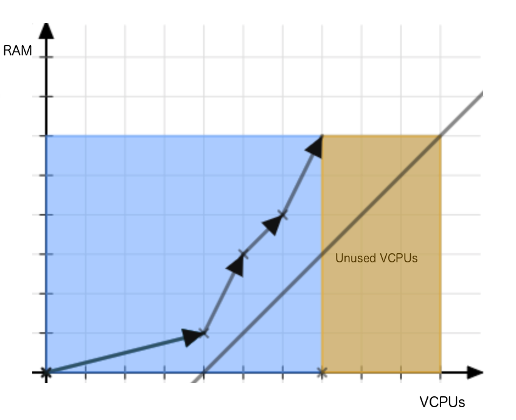
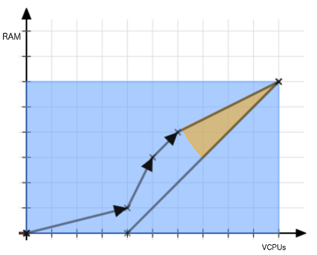
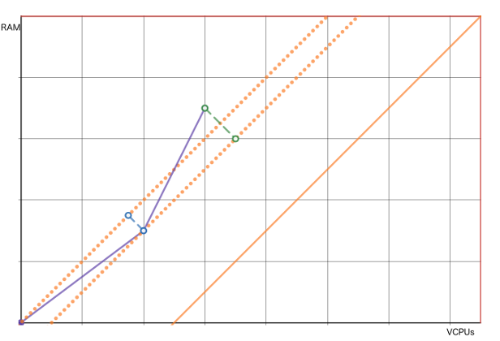

## Sobchak


> You mark that frame an eight, you're entering a world of pain. A world of
> pain.

_Sobchak_ is your friendly neighbourhood OpenStack instance scheduling optimizer,
which generates a list of instance migrations to optimally make use of
hypervisor resources.

### Installation

Installation is as simple as it gets; clone this repository, cd into it and
install with `pip`.

```bash
$ pip install .
```

### Usage

Make sure you've sourced your OpenStack openrc file, adjust the values set in
`config.yaml` and run _sobchak_!

```bash
$ sobchak
```

To generate a more human-readable report containing management-pleasing graphs
and information about the improvements made, just add the `--generate-report` or
`-R` argument.

```bash
$ sobchak -R
```

### How a list of migrations is generated

#### Forming a strategy

The problem we want to solve arises when compute nodes are running out of
assignable memory, but are left with a large number of spare Virtual CPU's or
vice versa.

_Sobchak_ tries to solve this problem by leaving compute nodes with available
memory and VCPU resources in a certain ratio so that VMs with a common VCPU/RAM
ratio can fill the remaining gap.



*Fig. 1: A hypervisor after naive instance scheduling.*

A great way to look at the problem is by looking at VCPU/memory pairs as
two-dimensional vectors; we must try to get the sum of VM vectors to match the
hypervisor vector as close as possible to distribute all available resources.
This can be achieved by predicting the slope/direction of the end of the VM
vector route and steering towards an extension of that slope.


*Fig. 2: The yellow line represents the direction of the most common RAM/VCPUs
ratio among smaller VMs.*

A way to determine if a hypervisor is on its way to use all of its resources, is
to compare the slope of the difference vector of the hypervisor and the sum of
all its VMs with the slope of the most common ratio within the small VMs. The
difference of the angles - let's call it the **relative angle** - will tell us
how well the hypervisor is on its way to use all resources (i.e. its absolute
value) and the direction it should change to (i.e. its sign).



*Fig. 3: The yellow angle represents the "relative angle".*

The bigger the relative angle, the more difficult it is to reach the angle
towards an optimal solution. We can use this number to find out which hypervisor
pairs can be used to "cancel each other out" by exchanging VMs.

Note that there is one scenario where a high absolute value of a relative angle
does not represent badly distributed resources; it's when both the assignable
memory and VCPU's are close to zero. This means that a relative angle should be
weighed with the sum of two reversed Sigmoid functions on both resources to
create a score which is also small when the hypervisor resources are almost
fully distributed.

#### Finding out where improvements can be made

So to summarize: we're able to give hypervisors a **score** which tells us how
well the resources have been distributed.

Besides its score, a hypervisor also has a certain potential (or lack of it) to
improve the score of other hypervisors.

If a hypervisor only contains VMs which use memory and processor resources in
the same ratio as the most common ratio, then those VMs cannot help another
hypervisor to "steer" towards the ideal path to perfect resource distribution.
On the other hand, a hypervisor containing VMs with uncommon resource ratio's
has the ability to improve another hypervisor's score by exchanging VMs.

Let's set some more definitions: a VM resource ratio which steers left or right
compared to the most common ratio gives its hypervisor **left-/right-handed
divergence**.



*Fig. 4: The blue dashed line represents right-handed divergence, the green
dashed line represents left-handed divergence.*

All these properties give us enough information to determine which hypervisors
should be paired to improve the overall resource distribution.
