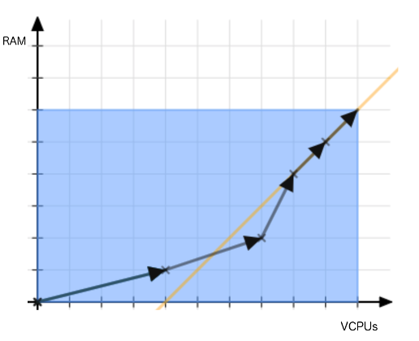

# Sobchak


> You mark that frame an eight, you're entering a world of pain. A world of
> pain.

Sobchak is your friendly neighbourhood OpenStack instance scheduling optimizer,
which generates a list of instance migrations to optimally make use of
hypervisor resources.

# How a list of migrations is generated

The problem we want to solve arises when compute nodes are running out of
assignable memory, but are left with a large number of spare Virtual CPU's or
vice versa.

Sobchak tries to solve this problem by leaving compute nodes with available
memory and VCPU resources in a certain ratio so that VMs with a common VCPU/RAM
ratio can fill the remaining gap.


_A hypervisor after naive instance scheduling._

A great way to look at the problem is by looking at VCPU/memory pairs as
two-dimensional vectors; we must try to get the sum of VM vectors to match the
hypervisor vector as close as possible to distribute all available resources.
This can be achieved by predicting the slope/direction of the end of the VM
vector route and steering towards an extension of that slope.



_The straight line represents the direction of the most common RAM/VCPUs ratio
among smaller VMs._

A way to determine if a hypervisor is on its way to use all of its resources, is
to compare the slope of the difference vector of the hypervisor and the sum of
all its VMs with the slope of the most common ratio within the small VMs. The
difference of the angles - let's call it the *relative angle* - will tell us how
well the hypervisor is on its way to use all resources (i.e. its absolute value)
and the direction it should change to (i.e. its sign).


_The yellow angle represents the "relative angle"._

The bigger the relative angle, the more difficult it is to reach the angle
towards an optimal solution. We can use this number to find out which hypervisor
pairs can be used to "cancel each other out" by exchanging VMs.

Note that there is one scenario where a high absolute value of a relative angle
does not represent badly distributed resources; it's when both the assignable
memory and VCPU's are close to zero. This means that a relative angle should be
weighed with the sum of two reversed Sigmoid functions on both resources to
create a *score* which is also small when the hypervisor resources are almost
fully distributed.

Now that we know which hypervisors should re-distribute their resources, we can
construct a list of migrations to patch things up.

- Load Hypervisor-VM inventory
- Until no improvement has been made:
  - Sort hypervisors on absolute score.
  - Try for each hypervisor (from highest absolute score to lowest):
    - Determine which hypervisor has the score which is closest to the inverse
      score of the current hypervisor.
    - Make a list of the VMs on both hypervisors.
    - Sort VMs by relative angle.
    - For each VM (from highest relative angle to lowest):
      - Calculate the difference between the hypervisor score and VM relative
        angle for each hypervisor.
      - Place VM under hypervisor with biggest difference (place on original
        hypervisor if scores are equal).
    - Check if improvement was made. If so: generate migration list & break
- Show JSON/CSV-formatted migration list.

# Installation

By default, Sobchak uses the OpenStack library to fetch hypervisor/instance
info, so you'll need to install the needed dependencies in a virtual
environment:

```
$ virtualenv -p python3 venv
$ source venv/bin/activate
$ pip install -r requirements.txt
```

# Usage

Make sure you've sourced your OpenStack openrc file, the rest is as easy as it
gets:

```bash
$ ./sobchak
```
